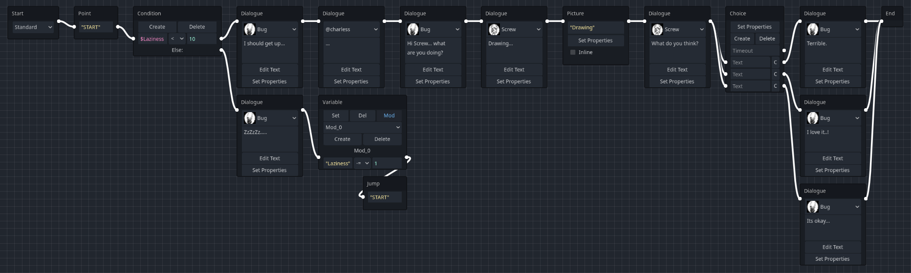
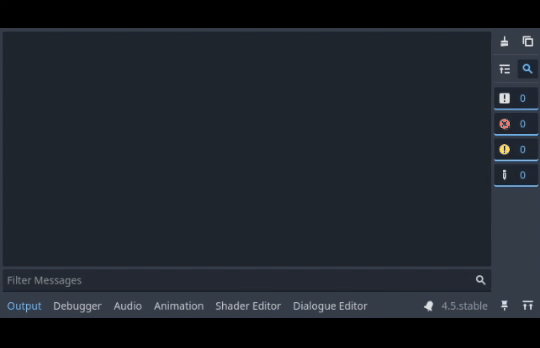

# Textbox
A Godot plugin for creating dialogues with various features like variable checks, randomized paths, manipulating the dialogue box etc... Supports static themes and player-following dialogue boxes in 2D/3D world space

Documentations included in the plugin directory. For a better reading experience, formatting style designed to be read directly from the Godot's editor

## Preview
### Example dialogue

### Using lister to manage resources

